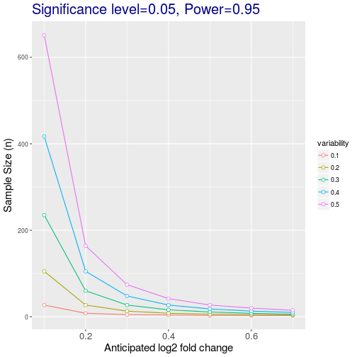

# Objectives

- Reading data in R
- Data manipulation and exploration
- Data distributions
- Select random sample and randomize MS run orders
- Visualisation
- Hypothesis testing: t-test 

---

Parts of the `data.frame` material is based on the
[R for data analysis and visualization](http://www.datacarpentry.org/R-ecology-lesson/index.html)
Data Carpentry course.

# Reading in data

The file we'll be reading in is a dataset that has been 1) processed
in Skyline and 2) summarized by each run and protein with
`MSstats`. We will practice with it.

**Tip** Often you'll get data delivered as a Microsoft Excel file. You
can export any spreadsheet to a `.csv` (comma separated values) file
in Excel through the `Save As.. > Format: Comma Separated Values
(.csv)` menu item.

In Rstudio, go to the `environnment` pane, click on `Import Dataset`
dropdown and choose `From Text File...` from the dropdown menu. Import
the `iPRG_example_runsummary.csv` file from your data directory, and
inspect that Rstudio correctly parsed the text file into an R
`data.frame`.


Now inspect the `Console` `Environment` pane again. Notice that a new
variable for the `iPRG_example` data frame was created in the
environment by executing the `read.csv` function. Let's have a look at
the documentation for this function by pulling up the help pages with
the `?`.


```r
iprg <- read.csv("./data/iPRG_example_runsummary.csv")
```

# Data frames

## Tidy data

The `iprg` object that we created is a `data.frame`


```r
class(iprg)
```

```
## [1] "data.frame"
```

These object are the equivalent of a sheet in a spreadsheet file. They
are composed on a set of columns, which are different vectors (or
characters, numerics, factors, ...) as seen prevously. 

There are actually some additional contstrains compared to a
spreadsheet. Rather than being limitations, these constrains are an
important feature that allow some standardisation and hence automatic
computations.

* All the data in a `data.frame` must be included in a column, as a
  vector. This means that it's not possible to add *random* notes or
  values, as is sometimes seen in spreadsheets. 
  
* All columns/vectors must have the same length, as opposed to
  spreadsheets, where sometimes some values or summary statistics are
  added at the bottom.
  
* No colours or font decorations.

This leads us to a very important concept in data formatting and data
manipuation, which is that data should be *tidy*, where 

* Columns describe different variables
* Rows describe different observations
* A cell contains a measurement or piece of information for a single
  observation.

There are two important reasons that we want tidy data

1. No need to tidy it up, which is a task many of us waste way to much
   time with.
2. The data is well structured, easy to read in, whatever the software
   or programming languages, and is easy to reason about.


Note that data is alwasy tidy, and for good reasons so. For example,
omics data is often presented as shown below


|         | rep1_0hr| rep1_16hr| rep1_24hr| rep1_48hr| rep1_72hr|
|:--------|--------:|---------:|---------:|---------:|---------:|
|P48432   |    0.486|     0.248|     0.177|     0.037|     0.026|
|Q62315-2 |    0.388|     0.196|     0.157|     0.105|     0.082|
|P55821   |    0.349|     0.258|     0.198|     0.089|     0.051|
|P17809   |    0.321|     0.169|     0.170|     0.109|     0.121|
|Q8K3F7   |    0.363|     0.237|     0.223|     0.091|     0.061|

which is not stictly tidy, as the protein intensity is presented along
muliple columns. 

> ### Challenge
> 
> Compare the structure of the data presented above and the `iprg`
> data.

## What are data frames?

Data frames are the _de facto_ data structure for most tabular data, and what we
use for statistics and plotting.

A data frame can be created by hand, but most commonly they are generated by the
functions `read.csv()` or `read.table()`; in other words, when importing
spreadsheets from your hard drive (or the web).

A data frame is the representation of data in the format of a table where the
columns are vectors that all have the same length. Because the column are
vectors, they all contain the same type of data (e.g., characters, integers,
factors). We can see this when inspecting the <b>str</b>ucture of a data frame
with the function `str()`:


```r
str(iprg)
```

```
## 'data.frame':	36321 obs. of  6 variables:
##  $ Protein      : Factor w/ 3027 levels "sp|D6VTK4|STE2_YEAST",..: 1 1 1 1 1 1 1 1 1 1 ...
##  $ Log2Intensity: num  26.8 26.6 26.6 26.8 26.8 ...
##  $ Run          : Factor w/ 12 levels "JD_06232014_sample1-A.raw",..: 2 3 1 4 5 6 7 8 9 11 ...
##  $ Condition    : Factor w/ 4 levels "Condition1","Condition2",..: 1 1 1 2 2 2 3 3 3 4 ...
##  $ BioReplicate : int  1 1 1 2 2 2 3 3 3 4 ...
##  $ Intensity    : num  1.18e+08 1.02e+08 1.01e+08 1.20e+08 1.16e+08 ...
```

## Inspecting `data.frame` Objects

We already saw how the functions `head()` and `str()` can be useful to check the
content and the structure of a data frame. Here is a non-exhaustive list of
functions to get a sense of the content/structure of the data. Let's try them out!

* Size:
    * `dim(iprg)` - returns a vector with the number of rows in the first element,
          and the number of columns as the second element (the **dim**ensions of
          the object)
    * `nrow(iprg)` - returns the number of rows
    * `ncol(iprg)` - returns the number of columns

* Content:
    * `head(iprg)` - shows the first 6 rows
    * `tail(iprg)` - shows the last 6 rows

* Names:
    * `names(iprg)` - returns the column names (synonym of `colnames()` for `data.frame`
	   objects)
    * `rownames(iprg)` - returns the row names

* Summary:
    * `str(iprg)` - structure of the object and information about the class, length and
	   content of  each column
    * `summary(iprg)` - summary statistics for each column

Note: most of these functions are "generic", they can be used on other types of
objects besides `data.frame`.


> ### Challenge
>
> Based on the output of `str(iprg)`, can you answer the following questions?
>
> * What is the class of the object `iprg`?
> * How many rows and how many columns are in this object?
> * How many proteins have been assayed?

## Indexing and subsetting data frames

Our data frame has rows and columns (it has 2 dimensions), if we want
to extract some specific data from it, we need to specify the
*coordinates* we want from it. Row numbers come first, followed by
column numbers. However, note that different ways of specifying these
coordinates lead to results with different classes.


```r
iprg[1]      # first column in the data frame (as a data.frame)
iprg[, 1]    # first column in the data frame (as a vector)
iprg[1, 1]   # first element in the first column of the data frame (as a vector)
iprg[1, 6]   # first element in the 6th column (as a vector)
iprg[1:3, 3] # first three elements in the 3rd column (as a vector)
iprg[3, ]    # the 3rd element for all columns (as a data.frame)
head_iprg <- iprg[1:6, ] # equivalent to head(iprg)
```

`:` is a special function that creates numeric vectors of integers in
increasing or decreasing order, test `1:10` and `10:1` for instance.

You can also exclude certain parts of a data frame using the `-` sign:


```r
iprg[, -1]          # The whole data frame, except the first column
iprg[-c(7:36321), ] # Equivalent to head(iprg)
```

As well as using numeric values to subset a `data.frame` columns can
be called by name, using one of the four following notations:


```r
iprg["Protein"]       # Result is a data.frame
iprg[, "Protein"]     # Result is a vector
iprg[["Protein"]]     # Result is a vector
iprg$Protein          # Result is a vector
```

For our purposes, the last three notations are equivalent. RStudio
knows about the columns in your data frame, so you can take advantage
of the autocompletion feature to get the full and correct column name.

> ### Challenge
>
> 1. Create a `data.frame` (`oprg_200`) containing only the observations from
>    row 200 of the `iprg` dataset.
>
> 2. Notice how `nrow()` gave you the number of rows in a `data.frame`?
>
>      * Use that number to pull out just that last row in the data frame.
>      * Compare that with what you see as the last row using `tail()` to make
>        sure it's meeting expectations.
>      * Pull out that last row using `nrow()` instead of the row number.
>      * Create a new data frame object (`iprg_last`) from that last row.
>
> 3. Use `nrow()` to extract the row that is in the middle of the data
>    frame. Store the content of this row in an object named `iprg_middle`.
>
> 4. Combine `nrow()` with the `-` notation above to reproduce the behavior of
>    `head(iprg)` keeping just the first through 6th rows of the iprg
>    dataset.


# Factors


When we did `str(iprg)` we saw that several of the columns consist of
numerics, however, the columns `Protein`, `Run`, and `Condition`, are
of a special class called a `factor`. Factors are very useful and are
actually something that make R particularly well suited to working
with data, so we're going to spend a little time introducing them.

Factors are used to represent categorical data. Factors can be ordered
or unordered, and understanding them is necessary for statistical
analysis and for plotting.

Factors are stored as integers, and have labels (text) associated with
these unique integers. While factors look (and often behave) like
character vectors, they are actually integers under the hood, and you
need to be careful when treating them like strings.

Once created, factors can only contain a pre-defined set of values,
known as *levels*. By default, R always sorts *levels* in alphabetical
order. For instance, if you have a factor with 2 levels:


```r
sex <- factor(c("male", "female", "female", "male"))
```

R will assign `1` to the level `"female"` and `2` to the level
`"male"` (because `f` comes before `m`, even though the first element
in this vector is `"male"`). You can check this by using the function
`levels()`, and check the number of levels using `nlevels()`:


```r
levels(sex)
```

```
## [1] "female" "male"
```

```r
nlevels(sex)
```

```
## [1] 2
```

Sometimes, the order of the factors does not matter, other times you
might want to specify the order because it is meaningful (e.g., "low",
"medium", "high"), it improves your visualization, or it is required
by a particular type of analysis. Here, one way to reorder our levels
in the `sex` vector would be:


```r
sex # current order
```

```
## [1] male   female female male  
## Levels: female male
```

```r
sex <- factor(sex, levels = c("male", "female"))
sex # after re-ordering
```

```
## [1] male   female female male  
## Levels: male female
```

In R's memory, these factors are represented by integers (1, 2, 3),
but are more informative than integers because factors are self
describing: `"female"`, `"male"` is more descriptive than `1`,
`2`. Which one is "male"?  You wouldn't be able to tell just from the
integer data. Factors, on the other hand, have this information built
in. It is particularly helpful when there are many levels (like the
species names in our example dataset).

### Converting factors

If you need to convert a factor to a character vector, you use
`as.character(x)`.


```r
as.character(sex)
```

```
## [1] "male"   "female" "female" "male"
```

### Using `stringsAsFactors=FALSE`

By default, when building or importing a data frame, the columns that
contain characters (i.e., text) are coerced (=converted) into the
`factor` data type. Depending on what you want to do with the data,
you may want to keep these columns as `character`. To do so,
`read.csv()` and `read.table()` have an argument called
`stringsAsFactors` which can be set to `FALSE`.

In most cases, it's preferable to set `stringsAsFactors = FALSE` when
importing your data, and converting as a factor only the columns that
require this data type.

> Challenge
> 
> Compare the output of `str(surveys)` when setting `stringsAsFactors = TRUE` (default) and `stringsAsFactors = FALSE`:

```r
iprg <- read.csv("data/iPRG_example_runsummary.csv", stringsAsFactors = TRUE)
str(iprg)
iprg <- read.csv("data/iPRG_example_runsummary.csv", stringsAsFactors = FALSE)
str(iprg)
```

# Other data structures

|          | dimensions | number of types | 
|:---------|------------|-----------------|
| vectors  |       1    |       1         | 
| matrix   |       2    |       1         | 
| array    |     any    |       1         | 
|data.frame|       2    | 1 per colums    | 
| list     | 1 (length) | any             |


# Data exploration

Let's explore some basic properties of our dataset. Go to the RStudio
Environment pane and double click the `iPRG_example` entry. This data
is in tidy,*long* format, which is an easier data format for data
manipulation operations such as selecting, grouping, summarizing, etc.

Data exported out of many omics processing or quantification tools are
often formatted in *wide* format, which is easier to read when we
would like to compare values (i.e intensity values) for specific
subjects (i.e peptides) across different values for a variable of
interest such as (i.e conditions). We'll format a summary of this
dataset as a 'wide' data frame later in this tutorial.

Let's do some more data exploration by examining how R read in the
iPRG dataset.


> ### Challenge: 
> 
> Explore the data as described below
>
> * What is the *class* of the variable?
> * What dimension is it? How many rows and columns does it have?
> * What variables (column names) do we have?
> * Look at the few first and last lines to make sure the data was
>   imported correctly.
> * Display a summary of the whole data.

Let's now inspect the possible values for the `Conditions` and the
`BioReplicate` columns. To aswer the questions, below, we will need to
use the `unique` function. From the manual page, we learn that 

> 'unique' returns a vector, data frame or array like 'x' but with
> duplicate elements/rows removed.

For example


```r
unique(c(1, 2, 4, 1, 1, 2, 3, 3, 4, 1))
```

```
## [1] 1 2 4 3
```

```r
unique(c("a", "b", "a"))
```

```
## [1] "a" "b"
```


```r
dfr <- data.frame(x = c(1, 1, 2),
                  y = c("a", "a", "b"))
dfr
```

```
##   x y
## 1 1 a
## 2 1 a
## 3 2 b
```

```r
unique(dfr)
```

```
##   x y
## 1 1 a
## 3 2 b
```

> ### Challenge

> * How many conditions are there?
> * How many biological replicates are there?
> * How many condition/biological replicates combinations are there?


It is often useful to start a preliminary analysis, or proceed with a
more detailed data exploration using a smalle subset of the data.

> ### Challenge
> 
> Select subsets of rows from iPRG dataset. Let's focus on 
> 
> * Condition 1 only 
> * Condition 1 and BioReplicate 1
> * all measurements on one particular MS run.
> * Conditions 1 and 2

> For each subset, how many measurements are there?

<!-- <details> -->
<!-- ```{r} -->
<!-- iprg.condition1 <- iprg[iprg$Condition == 'Condition1', ] -->
<!-- iprg.condition1.bio1 <- iprg[iprg$Condition == 'Condition1' & -->
<!--                              iprg$BioReplicate == 1, ] -->
<!-- nrow(iprg.condition1.bio1) -->

<!-- ## subset of data for condition1 or condition2 -->
<!-- iprg.condition1.2 <- iprg[iprg$Condition == 'Condition1' | -->
<!--                           iprg$Condition == 'Condition2', ] -->
<!-- nrow(iprg.condition1.2) -->

<!-- ## subset of data for condition1 or condition2 -->
<!-- iprg.condition1.2 <- iprg[which(iprg$Condition %in% c('Condition1', 'Condition2')), ] -->
<!-- nrow(iprg.condition1.2) -->
<!-- unique(iprg.condition1.2$Condition) -->
<!-- ``` -->
<!-- </details> -->

# Summarizing and visualizing data

## Histogram

Make a histogram of all the MS1 intensities, quantified by Skyline,
for `iPRG_example`.


```r
hist(iprg$Intensity)
```


Our histogram looks quite skewed. How does this look on log-scale? Do
you recognize this distribution? The distribution for log2-transformed
intensities looks very similar to the normal distribution. The
advantage of working with normally distributed data is that we can
apply a variety of statistical tests to analyzeand interpret our
data. Let's add a log2-scaled intensity column to our data so we don't
have to transform the original intensities every time we need them.


```r
hist(iprg$Log2Intensity,
     xlab = "log2 transformed intensities",
     main = "Histogram of iPRG data")
```



In this case, we have duplicated information in our data, we have the
raw and log-transformed data. This is not necessary (and not advised),
as it is straightforward to transform the data on the flight.


```r
hist(log2(iprg$Intensity),
     xlab = "log2 transformed intensities",
     main = "Histogram of iPRG data")
```


We look at the summary for the log2-transformed values including the
value for the mean. Let's fix that first.


```r
summary(iprg$Log2Intensity)
```

```
##    Min. 1st Qu.  Median    Mean 3rd Qu.    Max. 
##   16.37   23.78   24.68   24.82   25.78   31.42
```


> ### Challenge
> 
> Reproduce the histogram above but plotting the data on the log base
> 10 scale, using the `log10` function. See also the more general
> `log` function.

## Boxplot or box-and-whisker plot

Boxplots are extremely useful because they allow us to quickly
visualise the data distribution, without making assumptions of the
distribution type (non-parametric). We can read up on what statistics
the different elements of a box-and-whisker represent in the R help
files.


```r
boxplot(iprg$Log2Intensity)
```


The boxplot, however, shows us the intensities for all conditions and
replicates. If we want to display the data for, we have multile
possibilities.

* We can first split the data, using the `by` function


```r
int_by_run <- by(iprg$Log2Intensity, iprg$Run, c)
boxplot(int_by_run)
```


* We can use the formula syntax


```r
boxplot(Log2Intensity ~ Run, data = iprg)
```


* We can use the `ggplot2` package that is very flexible to visualise
  data under different angles.
  
  
# The `ggplot2`  package

**`ggplot2`** is a plotting package that makes it simple to create
complex plots from data in a data frame. It provides a more
programmatic interface for specifying what variables to plot, how they
are displayed, and general visual properties, so we only need minimal
changes if the underlying data change or if we decide to change from a
bar plot to a scatterplot. This helps in creating publication quality
plots with minimal amounts of adjustments and tweaking.

Fist of all, we need to load the `ggplot2` package


```r
library("ggplot2")
```

ggplot graphics are built step by step by adding new elements.

To build a ggplot we need to:

* bind the plot to a specific data frame using the `data` argument


```r
ggplot(data = iprg)
```

* define aesthetics (`aes`), by selecting the variables to be plotted
  and the variables to define the presentation such as plotting size,
  shape color, etc.


```r
ggplot(data = iprg, aes(x = Run, y = Log2Intensity))
```

* add `geoms` -- graphical representation of the data in the plot
     (points, lines, bars). To add a geom to the plot use `+` operator


```r
ggplot(data = iprg, aes(x = Run, y = Log2Intensity)) +
  geom_boxplot()
```


The `+` in the `ggplot2` package is particularly useful because it
allows you to modify existing `ggplot` objects. This means you can
easily set up plot "templates" and conveniently explore different
types of plots, so the above plot can also be generated with code like
this:


```r
# Assign plot to a variable
ints_plot <- ggplot(data = iprg, aes(x = Run, y = Log2Intensity))

# Draw the plot
ints_plot + geom_boxplot()
```


Notes:

 Anything you put in the `ggplot()` function can be seen by any geom layers
  that you add (i.e., these are universal plot settings). This includes the x and
  y axis you set up in `aes()`.
* You can also specify aesthetics for a given geom independently of the
  aesthetics defined globally in the `ggplot()` function.

* The `+` sign used to add layers must be placed at the end of each
  line containing a layer. If, instead, the `+` sign is added in the
  line before the other layer, `ggplot2` will not add the new layer
  and will return an error message.


> ### Challenge
> 
> * Repeat the plot above but displaying the raw intensities. 
> * Log-10 transform the raw intensities on the flight when plotting.

## Customising plots 

First, let's colour the boxplot based on the condition:


```r
ggplot(data = iprg,
       aes(x = Run, y = Log2Intensity,
           fill = Condition)) +
  geom_boxplot()
```


Now let's rename all axis labels and title, and rotate the x-axis
labels 90 degrees. We can add those specifications using the `labs`
and `theme` functions of the `ggplot2` package.


```r
ggplot(aes(x = Run, y = Log2Intensity, fill = Condition),
       data = iprg) +
    geom_boxplot() +
    labs(title = 'Log2 transformed intensity distribution per MS run',
         y = 'Log2(Intensity)',
         x = 'MS run') +
    theme(axis.text.x = element_text(angle = 90))    
```


And easily switch from a boxplot to a violin plot representation by
changing the `geom` type.


```r
ggplot(aes(x = Run, y = Log2Intensity, fill = Condition),
       data = iprg) +
    geom_violin() +
    labs(title = 'Log2 transformed intensity distribution per Subject',
         y = 'Log2(Intensity)',
         x = 'MS run') +
    theme(axis.text.x = element_text(angle = 90))
```


Finally, we can also overlay multiple geoms by simply *adding* them
one after the other.


```r
p <- ggplot(aes(x = Run, y = Log2Intensity, fill = Condition),
            data = iprg)
p + geom_boxplot()
```


```r
p + geom_boxplot() + geom_jitter() ## not very usefull
```


```r
p + geom_jitter() + geom_boxplot()
```


```r
p + geom_jitter(alpha = 0.1) + geom_boxplot()
```


> ### Challenge
> 
> * Overlay a boxplot goem on top of a jitter geom for the raw or
>   log-10 transfored intensities.
> * Customise the plot as suggested above.

# Randomization

## Random selection of samples from a larger set

This particular dataset contains a total of 10 subjects across
conditions. Suppose we label them from 1 to 14 and randomly would like
to select 3 subjects we can do this using the `sample` function. When
we run `sample` another time, different subjects will be selected. Try
this a couple times.


```r
sample(10, 3)
```

```
## [1]  9  1 10
```

```r
sample(10, 3)
```

```
## [1] 4 6 9
```

Now suppose we would like to select the same randomly selected samples
every time, then we can use a random seed number.


```r
set.seed(3728)
sample(10, 3)
```

```
## [1] 5 8 7
```

```r
set.seed(3728)
sample(10, 3)
```

```
## [1] 5 8 7
```

## Completely randomized order of MS runs

We can also create a random order using all elements of iPRG
dataset. Again, we can achieve this using `sample`, asking for exactly
the amount of samples in the subset. This time, each repetition gives
us a different order of the complete set.


```r
msrun <- unique(iprg$Run)
msrun
```

```
##  [1] JD_06232014_sample1_B.raw JD_06232014_sample1_C.raw
##  [3] JD_06232014_sample1-A.raw JD_06232014_sample2_A.raw
##  [5] JD_06232014_sample2_B.raw JD_06232014_sample2_C.raw
##  [7] JD_06232014_sample3_A.raw JD_06232014_sample3_B.raw
##  [9] JD_06232014_sample3_C.raw JD_06232014_sample4_B.raw
## [11] JD_06232014_sample4_C.raw JD_06232014_sample4-A.raw
## 12 Levels: JD_06232014_sample1-A.raw ... JD_06232014_sample4_C.raw
```

```r
# randomize order among all 12 MS runs
sample(msrun, length(msrun))
```

```
##  [1] JD_06232014_sample3_A.raw JD_06232014_sample3_C.raw
##  [3] JD_06232014_sample1_B.raw JD_06232014_sample4-A.raw
##  [5] JD_06232014_sample3_B.raw JD_06232014_sample4_B.raw
##  [7] JD_06232014_sample2_C.raw JD_06232014_sample4_C.raw
##  [9] JD_06232014_sample2_B.raw JD_06232014_sample1-A.raw
## [11] JD_06232014_sample1_C.raw JD_06232014_sample2_A.raw
## 12 Levels: JD_06232014_sample1-A.raw ... JD_06232014_sample4_C.raw
```

```r
# different order will be shown.
sample(msrun, length(msrun))
```

```
##  [1] JD_06232014_sample1_B.raw JD_06232014_sample3_B.raw
##  [3] JD_06232014_sample2_C.raw JD_06232014_sample1-A.raw
##  [5] JD_06232014_sample4_B.raw JD_06232014_sample2_A.raw
##  [7] JD_06232014_sample2_B.raw JD_06232014_sample3_A.raw
##  [9] JD_06232014_sample4_C.raw JD_06232014_sample1_C.raw
## [11] JD_06232014_sample3_C.raw JD_06232014_sample4-A.raw
## 12 Levels: JD_06232014_sample1-A.raw ... JD_06232014_sample4_C.raw
```

## Randomized block design

- Allow to remove known sources of variability that you are not
  interested in.

- Group conditions into blocks such that the conditions in a block are
  as similar as possible.

- Randomly assign samples with a block.

This particular dataset contains a total of 12 MS runs across 4
conditions, 3 technical replicates per condition. Using the
`block.random` function in the `psych` package, we can achieve
randomized block designs!


```r
# use 'psych' package
library(psych)
```

```
## 
## Attaching package: 'psych'
```

```
## The following objects are masked from 'package:ggplot2':
## 
##     %+%, alpha
```

```r
msrun <- unique(iprg[, c('Condition','Run')])
msrun
```

```
##     Condition                       Run
## 1  Condition1 JD_06232014_sample1_B.raw
## 2  Condition1 JD_06232014_sample1_C.raw
## 3  Condition1 JD_06232014_sample1-A.raw
## 4  Condition2 JD_06232014_sample2_A.raw
## 5  Condition2 JD_06232014_sample2_B.raw
## 6  Condition2 JD_06232014_sample2_C.raw
## 7  Condition3 JD_06232014_sample3_A.raw
## 8  Condition3 JD_06232014_sample3_B.raw
## 9  Condition3 JD_06232014_sample3_C.raw
## 10 Condition4 JD_06232014_sample4_B.raw
## 11 Condition4 JD_06232014_sample4_C.raw
## 12 Condition4 JD_06232014_sample4-A.raw
```

```r
# 4 Conditions of 12 MS runs randomly ordered
block.random(n=12, c(Condition=4))
```

```
##     blocks Condition
## S1       1         2
## S2       1         1
## S3       1         3
## S4       1         4
## S5       2         1
## S6       2         4
## S7       2         2
## S8       2         3
## S9       3         4
## S10      3         2
## S11      3         3
## S12      3         1
```

# Saving your work

You can save plots to a number of different file formats. PDF is by
far the most common format because it's lightweight, cross-platform
and scales up well but jpegs, pngs and a number of other file formats
are also supported. Let's redo the last barplot but save it to the
file system this time.

Let's save the boxplot as pdf file. 


```r
pdf()
p + geom_jitter(alpha = 0.1) + geom_boxplot()
dev.off()
```

The default file name is `Rplots.pdf`. We can customise that file name
specifying it by passing the file name, as a character, to the `pdf()`
function.

Finally, we can save this whole session you worked so hard on! We can
save individual variables using the `save` function, or save the
complete environment with `save.image`. Be careful though, as this can
save a lot of unnecessary (temporary) data.


```r
save.image(file = '02-rstats-all.rda')
```

The best way to save your work is to save the script that contains the
exact command that lead to the results! Or better, we can save and
document our full analysis in an R markdown file!

---
Back to course [home page](https://github.com/MayInstitute/MayInstitute2017/blob/master/Program3_Intro%20stat%20in%20R/README.md) 
