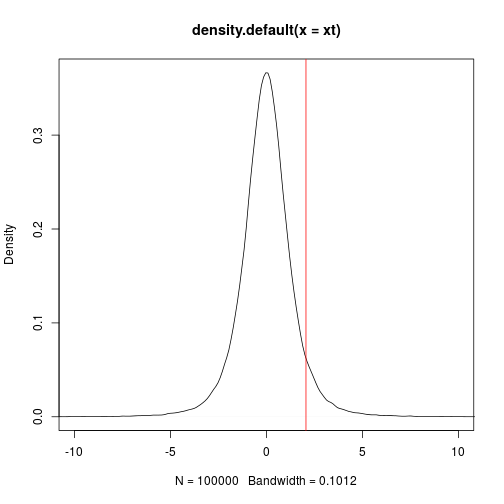

# Objectives

- Hypothesis testing: t-test
- Categorical data
- Power calculation

---

# Statistical hypothesis test in R

First, we are going to prepare the session for further analyses.


```r
load("./data/summaryresults.rda")
load("./data/iprg.rda")
```

## Two sample t-test for one protein with one feature

Now, we'll perform a t-test whether protein `sp|P44015|VAC2_YEAST` has
a change in abundance between Condition 1 and Condition 2.

### Hypothesis

* $H_0$: no change in abundance, mean(Condition1) - mean(Condition2) = 0
* $H_a$: change in abundance, mean(Condition1) - mean(Condition 2) $\neq$ 0

### Statistics

* Observed $t = \frac{\mbox{difference of group means}}{\mbox{estimate of variation}} = \frac{(mean_{1} - mean_{2})}{SE} \sim t_{\alpha/2, df}$
* Standard error, $SE=\sqrt{\frac{s_{1}^2}{n_{1}} + \frac{s_{2}^2}{n_{2}}}$

with 
* $n_{1}$ : Number of replicates
* $s_{1}^2 = \frac{1}{n_{1}-1} \sum (Y_{1i} - \bar{Y_{1 \cdot}})^2$ : Sample variance

### Data preparation


```r
## Let's start with one protein, named "sp|P44015|VAC2_YEAST"
oneproteindata <- iprg[iprg$Protein == "sp|P44015|VAC2_YEAST", ]

## Then, get two conditions only, because t.test only works for two
## groups (conditions).
oneproteindata.condition12 <- oneproteindata[oneproteindata$Condition %in% 
                                             c('Condition1', 'Condition2'), ]
oneproteindata.condition12
```

```
##                    Protein Log2Intensity                       Run
## 21096 sp|P44015|VAC2_YEAST      26.30163 JD_06232014_sample1_B.raw
## 21097 sp|P44015|VAC2_YEAST      26.11643 JD_06232014_sample1_C.raw
## 21098 sp|P44015|VAC2_YEAST      26.29089 JD_06232014_sample1-A.raw
## 21099 sp|P44015|VAC2_YEAST      25.81957 JD_06232014_sample2_A.raw
## 21100 sp|P44015|VAC2_YEAST      26.11527 JD_06232014_sample2_B.raw
## 21101 sp|P44015|VAC2_YEAST      26.08498 JD_06232014_sample2_C.raw
##        Condition BioReplicate Intensity
## 21096 Condition1            1  82714388
## 21097 Condition1            1  72749239
## 21098 Condition1            1  82100518
## 21099 Condition2            2  59219741
## 21100 Condition2            2  72690802
## 21101 Condition2            2  71180513
```

```r
unique(oneproteindata.condition12$Condition)
```

```
## [1] Condition1 Condition2
## Levels: Condition1 Condition2 Condition3 Condition4
```

```r
unique(oneproteindata$Condition)
```

```
## [1] Condition1 Condition2 Condition3 Condition4
## Levels: Condition1 Condition2 Condition3 Condition4
```

To perform the t-test, we use the `t.test` function. Let's first
familiarise ourselves with it by looking that the manual 


```r
?t.test
```

And now apply to to our data


```r
# t test for different abundance (log2Int) between Groups (Condition)
result <- t.test(Log2Intensity ~ Condition,
                 data = oneproteindata.condition12,
                 var.equal = FALSE)

result
```

```
## 
## 	Welch Two Sample t-test
## 
## data:  Log2Intensity by Condition
## t = 2.0608, df = 3.4001, p-value = 0.1206
## alternative hypothesis: true difference in means is not equal to 0
## 95 percent confidence interval:
##  -0.1025408  0.5619598
## sample estimates:
## mean in group Condition1 mean in group Condition2 
##                 26.23632                 26.00661
```

We can redo the t-test and change the confidence level for the log2 fold change.


```r
result.ci90 <- t.test(Log2Intensity ~ Condition, 
                      var.equal = FALSE,
                      data = oneproteindata.condition12,
                      conf.level = 0.9)
result.ci90
```

```
## 
## 	Welch Two Sample t-test
## 
## data:  Log2Intensity by Condition
## t = 2.0608, df = 3.4001, p-value = 0.1206
## alternative hypothesis: true difference in means is not equal to 0
## 90 percent confidence interval:
##  -0.02049268  0.47991165
## sample estimates:
## mean in group Condition1 mean in group Condition2 
##                 26.23632                 26.00661
```

### The `htest` class

The `t.test` function, like other hypothesis testing function, return
a result of a type we haven't encountered yet, the `htest` class:


```r
class(result)
```

```
## [1] "htest"
```

which stores typical results from such tests. Let's have a more
detailed look at what information we can learn from the results our
t-test. When we type the name of our `result` object, we get a short
textual summary, but the object contains more details:


```r
names(result)
```

```
## [1] "statistic"   "parameter"   "p.value"     "conf.int"    "estimate"   
## [6] "null.value"  "alternative" "method"      "data.name"
```

and we can access each of these by using the `$` operator, like we
used to access a single column from a `data.frame`, but the `htest`
class is not a `data.frame` (it's actually a `list`). For example, to
access the group means, we would use


```r
result$estimate
```

```
## mean in group Condition1 mean in group Condition2 
##                 26.23632                 26.00661
```

> ### Challenge
> 
> * Calculate the (log2-transformed) fold change between groups
> * Extract the value of the t-statistics
> * Calculate the standard error (fold-change/t-statistics)
> * Extract the degrees of freedom (parameter)
> * Extract the p values
> * Extract the 95% confidence intervals


```
## mean in group Condition1 
##                0.2297095
```

```
##        t 
## 2.060799
```

```
## mean in group Condition1 
##                0.1114662
```

```
##       df 
## 3.400112
```

```
## [1] 0.1206139
```

```
## [1] -0.1025408  0.5619598
## attr(,"conf.level")
## [1] 0.95
```

We can also manually compute our t-test statistic using the formulas
we descibed above and compare it with the `summaryresult`.

Recall the `summaryresult` we generated last section


```r
summaryresult
```

```
##        Group     mean         sd         se length ciw.lower.95
## 1 Condition1 26.23632 0.10396539 0.06002444      3     25.97805
## 2 Condition2 26.00661 0.16268179 0.09392438      3     25.60248
## 3 Condition3 23.25609 0.09467798 0.05466236      3     23.02090
## 4 Condition4 20.97056 0.73140174 0.42227499      3     19.15366
##   ciw.upper.95
## 1     26.49458
## 2     26.41073
## 3     23.49128
## 4     22.78746
```

```r
summaryresult12 <- summaryresult[1:2, ]

## test statistic, It is the same as 'result$statistic' above.
diff(summaryresult12$mean) ## same as result$estimate[1]-result$estimate[2]
```

```
## [1] -0.2297095
```

```r
sqrt(sum(summaryresult12$sd^2/summaryresult12$length)) ## same as stand error
```

```
## [1] 0.1114662
```

```r
## the t-statistic
diff(summaryresult12$mean)/sqrt(sum(summaryresult12$sd^2/summaryresult12$length))
```

```
## [1] -2.060799
```

## Re-calculating the p values

See the previous *Working with statistical distributions* for a
reminder.

Referring back to our t-test results above, we can manually calculate
the one- and two-side tests p-values using the t-statistics and the
test parameter (using the `pt` function).


Our result t statistic was 2.0607988 (accessible
with `result$statistic`). Let's start by visualising it along a t
distribution. Let's create data from such a distribution, making sure
we set to appropriate parameter.


```r
xt <- rt(1e5, result$parameter)
plot(density(xt), xlim = c(-10, 10))
abline(v = result$statistic, col = "red")
```


The area on the left of that point is given by `pt(result$statistic,
result$parameter)`, which is 0.939693. The p-value for a one-sided test is this given by


```r
1 - pt(result$statistic, result$parameter)
```

```
##          t 
## 0.06030697
```

And the p-value for a two-sided test is 


```r
2 * (1 - pt(result$statistic, result$parameter))
```

```
##         t 
## 0.1206139
```

which is the same as the one calculated by the t-test.


# Sample size calculation

To calculate the required sample size, you’ll need to know four
things:

* $\alpha$: confidence level
* $power$: 1 - $\beta$, where $\beta$ is probability of a true positive discovery
* $\Delta$: anticipated fold change
* $\sigma$: anticipated variance

## R code

Assuming equal varaince and number of samples across groups, the
following formula is used for sample size estimation:

$$\frac{2{\sigma}^2}{n}\leq(\frac{\Delta}{z_{1-\beta}+z_{1-\alpha/2}})^2$$


```r
library("pwr")

## ?pwr.t.test

# Significance level alpha
alpha <- 0.05

# Power = 1 - beta
power <- 0.95

# anticipated log2 fold change 
delta <- 1

# anticipated variability
sigma <- 1.5

# Effect size
# It quantifies the size of the difference between two groups
d <- delta/sigma

#Sample size estimation
pwr.t.test(d = d, sig.level = alpha, power = power, type = 'two.sample')
```

```
## 
##      Two-sample t test power calculation 
## 
##               n = 59.45415
##               d = 0.6666667
##       sig.level = 0.05
##           power = 0.95
##     alternative = two.sided
## 
## NOTE: n is number in *each* group
```

Then, we investigate the effect of required fold change and variance on the sample size estimation.


```r
# anticipated log2 fold change 
delta <- seq(0.1, 0.7, .1)
nd <- length(delta)

# anticipated variability
sigma <- seq(0.1,0.5,.1)
ns <- length(sigma)

# obtain sample sizes
samsize <- matrix(0, nrow=ns*nd, ncol = 3)
counter <- 0
for (i in 1:nd){
  for (j in 1:ns){
    result <- pwr.t.test(d = delta[i]/sigma[j],
                         sig.level = alpha, power = power,
                         type = "two.sample")
    counter <- counter + 1
    samsize[counter,1] <- delta[i]
    samsize[counter,2] <- sigma[j]
    samsize[counter,3] <- ceiling(result$n)
  }
}
colnames(samsize) <- c("fd","var","value")


library("ggplot2")
samsize <- as.data.frame(samsize)
samsize$var <- as.factor(samsize$var)
ggplot(data=samsize, aes(x=fd, y=value, group = var, colour = var)) +
  geom_line() +
  geom_point(size=2, shape=21, fill="white") +
  labs(title="Sig=0.05 Power=0.05", x="Anticipated log2 fold change", y='Sample Size (n)') +
  theme(plot.title = element_text(size=20, colour="darkblue"),
        axis.title.x = element_text(size=15),
        axis.title.y = element_text(size=15),
        axis.text.x = element_text(size=13)) 
```




# Comparison of two proportions in R

For part 2, we are using a new dataset, which contains the patient
information from TCGA colorectal cohort. Rows in the data array are
patients and columns are patient information. The column definition is
shown as following:

| Variable            |
|---------------------|
| TCGA participant ID |
| Gender              |
| Cancer type         |
| BTAF mutation status|
| History of colon polyps |

## Generate 2-way contingency tables

We first need to calculate 2-way contingency tables for the following tests. 


```r
#Dataset is from nature paper: Proteogenomic characterization of human colon and rectal cancer (Zhang et al. 2014)
#Load in the TCGA colorectal cancer sample informtaion 
TCGA.CRC <- read.csv("./data/TCGA_sample_information.csv")
head(TCGA.CRC)
```

```
##   TCGA.participant.ID Gender Cancer BRAF.mutation history_of_colon_polyps
## 1        TCGA-A6-3807 Female  Colon             0                      NO
## 2        TCGA-A6-3808   Male  Colon             0                     YES
## 3        TCGA-A6-3810   Male  Colon             0                     YES
## 4        TCGA-AA-3518 Female  Colon             0                      NO
## 5        TCGA-AA-3525   Male  Colon             1                      NO
## 6        TCGA-AA-3526   Male  Colon             0                     YES
```

```r
#`colnames` is short for column names. 
colnames(TCGA.CRC)
```

```
## [1] "TCGA.participant.ID"     "Gender"                 
## [3] "Cancer"                  "BRAF.mutation"          
## [5] "history_of_colon_polyps"
```

```r
# Select columns from TCGA dataset: 
# We are interested in the cancer type and history of colon polyps
TCGA.CRC.gc <- TCGA.CRC[, c('Cancer', 'history_of_colon_polyps')]
nrow(TCGA.CRC.gc)
```

```
## [1] 78
```

```r
#Generate 2-way contingency tables
ov <- table(TCGA.CRC.gc)
ov
```

```
##         history_of_colon_polyps
## Cancer   NO YES
##   Colon  31  22
##   Rectum 20   5
```

```r
#dotchart
dotchart(t(ov), xlab="Observed counts")
```


## Z-test

$$Z=\frac{\widehat{\pi}_1-\widehat{\pi}_2}{\sqrt{\frac{\widehat{\pi}_1(1 - \widehat{\pi}_1)}{n_1}+\frac{\widehat{\pi_2}(1 - \widehat{\pi_2})}{n_2}}}$$
where $\widehat{\pi}_1 = \frac{y_{1}}{n_1}$ and $\widehat{\pi}_2 = \frac{y_{2}}{n_2}$.


```r
#p-value
z.prop.p = function( x1, x2, n1, n2){
    pi_1 <- x1/n1
    pi_2 <- x2/n2
    numerator = pi_1 - pi_2
    denominator = sqrt(((pi_1*(1-pi_1))/n1 + (pi_2*(1-pi_2))/n2))
    stat <- numerator/denominator
    pvalue <- 2*(1 - pnorm(abs(stat)))
    return(pvalue)
}

#confidence interval
z.prop.ci = function( x1, x2, n1, n2, alpha = 0.05){
  pi_1 <- x1/n1
  pi_2 <- x2/n2
  numerator = pi_1 - pi_2
  denominator = sqrt(((pi_1*(1-pi_1))/n1 + (pi_2*(1-pi_2))/n2))
  cri_value <- qnorm(1-alpha/2)
  prop.ci = c(numerator + cri_value*denominator, numerator - cri_value*denominator)
  return(prop.ci)
}

z.prop.p(ov[1,1], ov[2,1], sum(ov[1,]), sum(ov[2,]))
```

```
## [1] 0.04010935
```

```r
z.prop.ci(ov[1,1], ov[2,1], sum(ov[1,]), sum(ov[2,]))
```

```
## [1] -0.009709539 -0.420479141
```

## Chi-squared test

**Hypothesis** : 

$H_0$ : each population has the same proportion of observations, $\pi_{j=1|i=1} = \pi_{j=1|i=2}$

$H_a$ : different population has different proportion of observations$


$$\chi^2 =\sum_{i=1}^2 \sum_{j=1}^2 \frac{(O_{ij}-E_{ij})^2}{E_{ij}} \sim \chi^2_{(2-1)(2-1)}$$

$O_{ij}$ : $n_{ij}$, which is the count within the cells

$E_{ij}$ : $n_{i+}n_{+j}/n$, where $n_{i+}$ is the row count sum, $n_{+j}$ is the column count sum and n is the total count.


```r
#Hypothesis: whether the proportion of patients who have history of colon polyps in the patients with colon cancer is different from that in the patients with rectal cancer
#chi-square test
pt <- prop.test(ov)
pt
```

```
## 
## 	2-sample test for equality of proportions with continuity
## 	correction
## 
## data:  ov
## X-squared = 2.5871, df = 1, p-value = 0.1077
## alternative hypothesis: two.sided
## 95 percent confidence interval:
##  -0.44991310  0.01972442
## sample estimates:
##    prop 1    prop 2 
## 0.5849057 0.8000000
```

```r
# name of output
names(pt)
```

```
## [1] "statistic"   "parameter"   "p.value"     "estimate"    "null.value" 
## [6] "conf.int"    "alternative" "method"      "data.name"
```

```r
# proportion in each group
pt$estimate 
```

```
##    prop 1    prop 2 
## 0.5849057 0.8000000
```

```r
# test statistic value
pt$statistic 
```

```
## X-squared 
##  2.587111
```

```r
# degree of freedom
pt$parameter
```

```
## df 
##  1
```

## Fisher’s exact test

The Fisher’s exact test can be used with small sample sizes. It compares distributions of counts within the 4 cells.


```r
#Fisher's Exact Test
ft <- fisher.test(ov) 
ft
```

```
## 
## 	Fisher's Exact Test for Count Data
## 
## data:  ov
## p-value = 0.07734
## alternative hypothesis: true odds ratio is not equal to 1
## 95 percent confidence interval:
##  0.09057002 1.18269896
## sample estimates:
## odds ratio 
##  0.3567853
```

```r
# odds ratio
ft$estimate 
```

```
## odds ratio 
##  0.3567853
```


--- 

Back to course [home page](https://github.com/MayInstitute/MayInstitute2017/blob/master/Program3_Intro%20stat%20in%20R/README.md)
