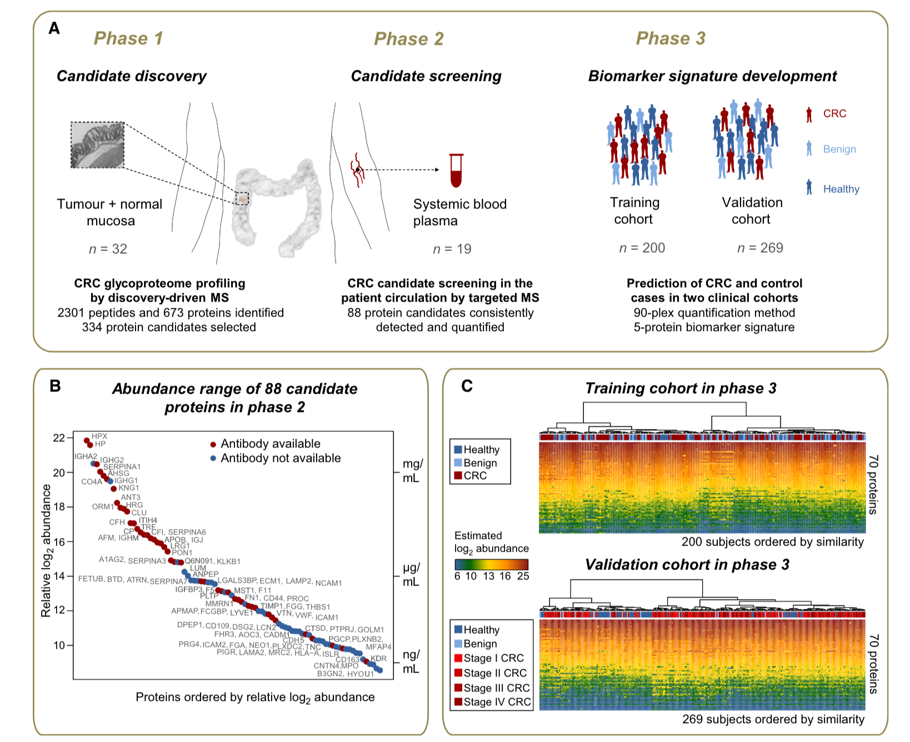

```{r setup, include=FALSE}
knitr::opts_chunk$set(echo = TRUE)
```

# Objectives

- Creating a new RStudio project

- Reading in data

- Data manipulation

- Visualizing data

- Saving your work

Part 1 and 2 are adapted from the material of May Institute [Beginner's statistics in R](https://github.com/MayInstitute/MayInstitute2017/blob/master/Program3_Intro%20stat%20in%20R/01-rstats.Rmd).

---

# 1. Create a new Rstudio project

It is good practice to keep a set of related data, analyses, and text
self-contained in a single folder, called the **working directory**. All of the
scripts within this folder can then use *relative paths* to files that indicate
where inside the project a file is located (as opposed to absolute paths, which
point to where a file is on a specific computer). Working this way makes it
a lot easier to move your project around on your computer and share it with
others without worrying about whether or not the underlying scripts will still
work.

Below, we will go through the steps for creating an "R Project" for this
tutorial.

* Under the `File` menu, click on `New project`, choose `New directory`, then
  `Empty project`
* Enter a name for this new folder (or "directory"), and choose a convenient
  location for it. This will be your **working directory** for the rest of the
  day (e.g., `datavis`)
* Click on `Create project`
* Create a new R script in your working directory, calling it e.g., `part1-script.R`.

---

# 2. Reading in data

The file we'll be reading in is a public protein quantification dataset (Reference: http://onlinelibrary.wiley.com/doi/10.15252/emmm.201404873/abstract) that has been summarized by each run and protein with MSstats. Its experimental design is shown below:



We will practice with it throughout the whole module.

```{r}
CRC <- read.csv("./data/CRC_train.csv")
```

---

# 3. Data exploration

Let's explore some basic properties of our dataset. Go to the RStudio Environment pane and double click the `CRC` entry. 

`class` shows the type of a variable, in this case a data.frame

```{r}
class(CRC)
```

`dim` shows the dimension of a data.frame, which are the number of rows and the number of columns

```{r}
dim(CRC)
```

We can see this when inspecting the <b>str</b>ucture of a data frame
with the function `str()`:

```{r,eval=F}
str(CRC)
```

`colnames` is short for column names. 

```{r,eval=F}
colnames(CRC)
```

`head` shows the first 6 rows of data. Try `tail` to show the last 6 rows of data.

```{r,eval=F}
head(CRC)
```

Let's explore the type of every column/variable and a summary for the value range for every column.

```{r,eval=F}
summary(CRC)
```

Inspect the possible values for the `Group` column using the named and numbered column selection syntax for data frames.
```{r}
unique(CRC[, 'Sub_group'])
unique(CRC[, 79])
```

We may be interested in working from here on only with data for proteins TIMP1 and SERPINA3.
```{r}
CRC.twopro <- CRC[,c('TIMP1', 'SERPINA3')]
```

We may be also interested in only CRC data.
```{r}
CRC_tumor <- CRC[CRC$Sub_group=="CRC",]
```

---

# 4. Visualizing data
Let's make the scatter plot with `ggplot2`, one of the most popular and powerful R packages for making graphics. `ggplot2` is a plotting package that makes it simple to create complex plots from data in a data frame. It provides a more
programmatic interface for specifying what variables to plot, how they
are displayed, and general visual properties, so we only need minimal
changes if the underlying data change or if we decide to change from a
bar plot to a scatterplot. This helps in creating publication quality
plots with minimal amounts of adjustments and tweaking.

Fist of all, we need to load the `ggplot2` package

```{r}
# install.packages("ggplot2")
library(ggplot2)
```

ggplot() initializes a ggplot object. It can be used to declare the input data frame for a graphic and to specify the set of plot aesthetics intended to be common throughout all subsequent layers unless specifically overridden.

```{r}
ggplot(data = CRC)
```

aesthetics (`aes`) include the variables to be plotted and the variables to define the presentation such as:

* position (i.e., on the x and y axes)
* color ("outside" color)
* fill ("inside" color)
* shape (of points)
* linetype
* size
* alpha 

```{r}
ggplot(data = CRC, aes(x = SERPINA3, y = TIMP1))
```

Geometic Objects (`geoms`) are the actual marks we put on a plot, such as point, line, bar. To add a geom to the plot use `+` operator

```{r}
ggplot(data = CRC, aes(x = SERPINA3, y = TIMP1)) +
  geom_point()
```

The above plot can also be made with code like this:
```{r}
## Assign plot to a variable
g <- ggplot(data = CRC, aes(x = SERPINA3, y = TIMP1))

## Draw the plot
g + geom_point()
```

> **Challenge**
> 
> If you want to explore the relationship between the abundance of protein *AFM* and *AHSG*,  what plot will you make?

$~$

$~$

$~$

$~$

$~$

$~$


```{r}
ggplot(data = CRC) +
  geom_point(mapping = aes(x = AFM, y = AHSG))
```

Add Aesthetics feature to the plot:  Colour and shape may work well with categorical variables, while size works well for continuous variables.

```{r}
# Different color for different groups
ggplot(data = CRC, aes(x = SERPINA3, y = TIMP1, color = Sub_group)) +
  geom_point()

# Different size for different groups
ggplot(data = CRC, aes(x = SERPINA3, y = TIMP1, size = Sub_group)) +
  geom_point()

# Different shape for different groups
ggplot(data = CRC, aes(x = SERPINA3, y = TIMP1, shape = Sub_group)) +
  geom_point()

# Different opacity value for different groups
ggplot(data = CRC, aes(x = SERPINA3, y = TIMP1, alpha = Sub_group)) +
  geom_point()

# Change the shape from solid to empty
ggplot(data = CRC, aes(x = SERPINA3, y = TIMP1, shape = Sub_group)) +
  geom_point() +
  scale_shape_discrete(solid=F)
```

Facetting creates tables of graphics by splitting the data into subsets and displaying the same graph for each subset

```{r}
ggplot(data = CRC, aes(x = SERPINA3, y = TIMP1)) +
  geom_point() + 
  facet_grid(~ Sub_group)

# Combine Facetting and color
ggplot(data = CRC, aes(x = SERPINA3, y = TIMP1, color = Sub_group)) +
  geom_point() +
  facet_grid(~ Sub_group)

ggplot(data = na.omit(CRC_tumor), aes(x = SERPINA3, y = TIMP1, color = Gender)) +
  geom_point() +
  facet_grid(Cancer_stage ~ Tumour_location, scales = "free")

# Free axis limit
ggplot(data = na.omit(CRC_tumor), aes(x = SERPINA3, y = TIMP1, color = Gender)) +
  geom_point() +
  facet_grid(Cancer_stage ~ Tumour_location, scales = "free")
```

---

# 5. Saving your work 

You can save plots to a number of different file formats. PDF is by far the most common format because it's lightweight, cross-platform and scales up well but jpegs, pngs and a number of other file formats are also supported. Let's redo the last barplot but save it to the file system this time. 

Let's save the boxplot as pdf file.
```{r,eval=T, warning=F, message=F}
pdf("myplot1.pdf", width=4, height=4)
ggplot(data = CRC, aes(x = SERPINA3, y = TIMP1, color = Sub_group)) +
  geom_point() +
  facet_grid(~ Group)
dev.off()

## ggplot2 function
ggsave("myplot2.pdf", width = 6, height = 6)
```

Finally, we can save this whole session you worked so hard on! 

```{r,eval=T}
save.image(file='Handson1.RData')
```

> **Challenge**
> If you want to explore the relationship between the abundance of protein AFM and AHSG in cancer tissue and see the difference across different cancer stage, what plot will you make?
Save your plot!

$~$

$~$

$~$

$~$

$~$

$~$

```{r}
ggplot(data = CRC_tumor) +
  geom_point(mapping = aes(x = AFM, y = AHSG,color = as.factor(Cancer_stage)))
ggsave("my-plot.pdf", width = 6, height = 6)
```

# 6. R markdown

Markdown (extension `.md`) is a very simple markup language in plain
text, that can be converted to many different outputs, such as pdf and
html to name a few.

It is also possible to interleave R code into markdown documents,
producing so called R mardown documents (extension `.Rmd`). Before
generating the final html or pdf output, the `Rmd` files are first
*knit*, i.e. the R code chunks are extracted, exectuted
and replaced by their output, be it text, tables or figures. 

Rmarkdown is a fantastic tool to implement **reproducible research**,
as we have the guarantee that code results and figures, displayed in
the final document, accurately represent the analysis restults. They
provide a relatively easly way to generate high quality and
reproducible analysis reports for any arbitrary input data that is
submitted to an established analysis routine. The R package that
supports this is [`rmarkdown`](http://rmarkdown.rstudio.com/), and the
whole process is made relatively easy with RStudio and available
[documentation](http://rmarkdown.rstudio.com/lesson-1.html).

We are going to walk through the creation of such a document.

