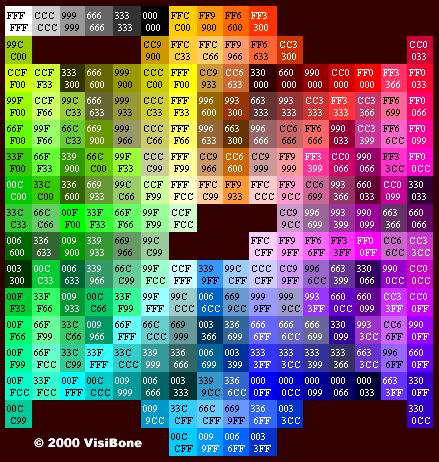

```{r setup, include=FALSE}
knitr::opts_chunk$set(echo = TRUE)
```

# Objectives

* Color charts in R
* Change plot colors in ggplot2
    + Change color globally
    + Mapping variable values to colors

Reference: http://www.cookbook-r.com/Graphs/Colors_(ggplot2)/

---

# 1. Color charts in R

## 1.1 Hexadecimal color code chart

Colors can specified as a hexadecimal RGB triplet, such as "#0066CC". For example, in the table below, "#FFFFFF" is white and "#990000" is a deep red.



## 1.2 RColorBrewer palette chart
RColorBrewer is a good R package for color palettes. It contains the following color palettes.


***

# 2. Change plot colors in ggplot2

In this section we’ll continue using CRC dataset.

```{r, echo=T, warning=FALSE}
library(ggplot2)
CRC <- read.csv("./data/CRC_train.csv")
```

## 2.1 Change color globally

The colors of lines and points can be set directly using colour. The colors of filled objects, like bars, can be set using fill.

```{r,eeval=T,echo=T, fig.width=5, fig.height=4}
# Default black lines and points
g <- ggplot(CRC[1:100,],aes(Sample, SERPINA3, group = 1))
g + geom_point(size = 0.5) +
  geom_line()

# Dark blue lines, red dots
g + geom_point(size = 0.5, colour="#CC0000") +
  geom_line(colour="#000099")

# Default dark bars
g1 <- ggplot(CRC, aes(Sub_group)) 
g1 + geom_bar()

# Red fill, black outlines
g1 + geom_bar(fill="#FF9999", colour="yellow") 
```

> **Challenge**
> Plot the scatter plot of the abundance of protein AFM and AHSG and change the color of points to blue globally.

$~$

$~$
$~$

$~$
$~$

$~$
$~$

$~$
$~$

$~$
$~$

$~$

```{r}
ggplot(CRC, aes(x = AFM, y = AHSG))+
  geom_point(colour="#0066cc")

```

## 2.2 Mapping variable values to colors
We can also map variables to colors by putting it inside an `aes()` statement.

```{r,eeval=T,echo=T, fig.width=5, fig.height=4}
# Default: dark color
g2 <- ggplot(CRC, aes(x = SERPINA3, y = TIMP1))
g2 + geom_point()

# Make the color conditional on 'Sub_group'
g2 + geom_point(mapping = aes(color = Sub_group))
```

It is also possible to change manually the colors using the functions:

* scale_color_grey() : to use grey color palettes
* scale_color_manual() : to use custom colors
* scale_color_brewer() : to use color palettes from RColorBrewer package

```{r}
# Sequential grey colour scales
g2 + geom_point(mapping = aes(color = Sub_group)) +
  scale_color_grey()

# Change the colour manually
g2 + geom_point(mapping = aes(color = Sub_group)) + 
  scale_color_manual(values=c("#999999", "#E69F00", "#56B4E9"))

# RColorBrewer is a good R package for color palettes.
# Its function has an argument for the number of colors and the color palette
# install.packages("RColorBrewer")
library(RColorBrewer)
brewer.pal(4, "Set1")
g2 + geom_point(mapping = aes(color = Sub_group)) + 
  scale_color_manual(values=brewer.pal(3, "Set1"))

# Sequential purple colour scales
g2 + geom_point(mapping = aes(color = Sub_group)) +
  scale_color_brewer(palette = "Purples")

# Diverging Spectral color
g2 + geom_point(mapping = aes(color = Sub_group)) +
  scale_color_brewer(palette = "Spectral")

# Qualitative Set1 color
g2 + geom_point(mapping = aes(color = Sub_group)) +
  scale_color_brewer(palette = "Set1")
```


> **Challenge**
> Plot the scatter plot of the abundance of protein AFM and AHSG and specify the color by gender using "Paired" palette.

$~$

$~$
$~$

$~$
$~$

$~$
$~$

$~$
$~$

$~$
$~$

$~$


```{r}
ggplot(CRC, aes(x = AFM, y = AHSG))+
  geom_point(mapping = aes(color = Gender))+
  scale_color_brewer(palette = "Paired")
```